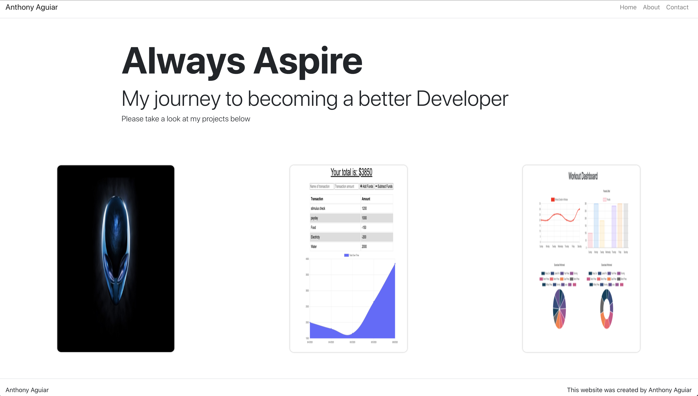

# React Portfolio
  

## Description
This is my second attempt at a portfolio website, however this time the application is using React, and Node.

## Table of Contents
* [Description](#Description)
* [Installation](#Installation)
* [Usage](#Usage)
* [Licensing](#License)
* [Contributions](#Contributions)
* [Testing](#Tests)

## Installation

```
npm i
```

## Usage


## License
ISC

## Contributions
Anthony Aguiar

## Tests
```
N/A
```

## Questions 
You can click the following link to be taken to my GitHub profile: (http://github.com./EpicGibbon)

Please feel free to checkout the live application here! https://epicgibbon.github.io/react_portfolio/


Feel free to reach out to me with any questions or comments: [mailto:Michant1997@gmail.com]
